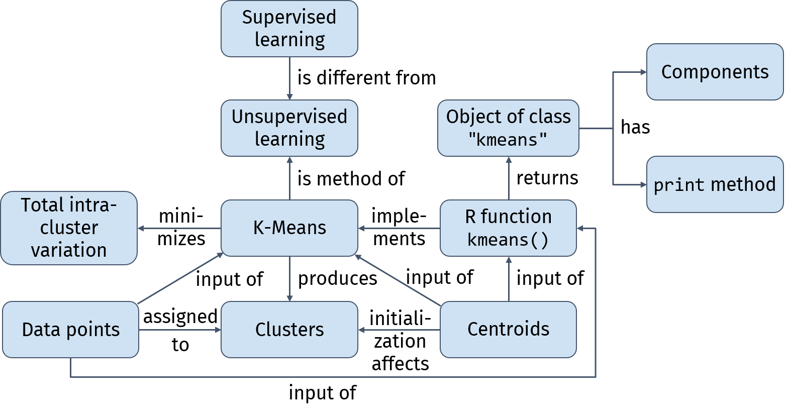

```{r setup, include=FALSE}
Sys.setlocale("LC_ALL","English")
Sys.setenv(LANG = "en_US.UTF-8")
Sys.setlocale("LC_TIME", "English")

# The version number in the directory name of an HTML dependency can be
# suppressed by setting options(htmltools.dir.version = FALSE) when the
# dependency is copied via `copyDependencyToDir()`. 
options(htmltools.dir.version = FALSE)
options(width = 90) # width of console output
# load fonts (mainly Fira Sans)
# extrafont::font_import()
extrafont::loadfonts("win", quiet = TRUE)

# set default knitr options
knitr::opts_chunk$set(fig.width = 5, fig.height = 4, fig.retina = 4)
knitr::opts_chunk$set(eval = TRUE, echo = TRUE, warning = TRUE, 
                      message = FALSE, cache = FALSE)

ggplot2::theme_set(
  ggplot2::theme_minimal(base_size = 18, base_family = "Fira Sans") +
    ggplot2::theme(panel.grid.minor = ggplot2::element_blank()) + 
    ggplot2::theme(axis.line = ggplot2::element_line()) + 
    ggplot2::theme(axis.ticks = ggplot2::element_line())
)

library(tidyverse)
library(tidymodels)
library(AmesHousing)
set.seed(123)
ames <- make_ames() %>% 
  select(area = Gr_Liv_Area, price = Sale_Price) %>%
  slice_sample(n = 500) %>%
  mutate(area = 0.092903 * area)

#library(palmerpenguins)
#peng <- penguins %>%
#  select(length = bill_length_mm, depth = bill_depth_mm) %>%
#  drop_na()
```

class: title-slide, center, bottom

# `r rmarkdown::metadata$title`

## `r rmarkdown::metadata$subtitle`

### `r rmarkdown::metadata$author`

### `r rmarkdown::metadata$date`

.courtesy[&#x1F4F7; Photo courtesy of Ulrich Arendt]

???

Today, unsupervised learning.

---

name: learner-persona

## Learner Persona 

(**Course:** "Introduction to Data Mining with R")

.font130[_Meet Nathalie..._]

**1. Background:** Nathalie is a 22-year-old undergraduate student pursuing a Bachelor's degree in "Operations Research and Business Analytics". 
She is born in Turkey, and moved to Germany to take up her study. 

**2. Relevant Experience:** Currently, Nathalie is in her 5th semester. 
Until now, she has been analyzing data mainly with Excel, and has some working knowledge of SPSS, but she has never programmed in R prior to taking this course. 

**3. Needs:** Nathalie is enrolled in this course which is required for her degree, so she needs to pass it. 
However, she is also interested in this course because she knows that showing R proficiency on her CV will increase her value on the job market. 
She needs a gentle introduction to R, also focusing on differences between the tools she currently uses and a programming language (_What are loops?, What is a function?, ..._).

**4. Special considerations:** Nathalie has little experience in programming and she doesn't have a very powerful laptop.

---

## Recap: Supervised Learning

**General idea**: train a model which estimates the value of the response based on the values of the predictors. 

$$\hat{Y}=f(\mathbf{X})$$

```{r reg-model, echo = FALSE, cache=TRUE}
lm_spec <- linear_reg() %>% 
  set_engine(engine = "lm") %>%
  set_mode(mode = "regression")
m <- fit(lm_spec, price ~ area, ames)
p <- predict(m, new_data = ames)
```


```{r reg-model-residuals, echo=FALSE, fig.width = 25/2.54, fig.height = 15/2.54, fig.align='center', cache = TRUE}
ames %>%
  bind_cols(p) %>%
  mutate(residual = .pred - price) %>%
  ggplot(aes(area, price)) + 
  scale_x_continuous(limits = c(0, 360), expand = c(0,0)) +
  scale_y_continuous(limits = c(0, 630000), expand = c(0,0), labels = scales::comma) +
  geom_segment(aes(xend = area, yend = .pred), color = "red", size = 0.25, linetype = 2) +
  geom_point(size = 1.25) +
  geom_abline(slope = m$fit$coefficients[2],
              intercept = m$fit$coefficients[1],
              color = "royalblue3", size = 1.5) +
  labs(x = "Living area [m²]", y = "House price [US$]")
```

???

As a quick recap, so far, we have exclusively discussed supervised models.

The general idea of supervised learning is to train a function f which estimates the value of the response Y based on the values of the predictors X.

An example is predicting the sale price of a house based on the size of its living area.
Here, house price is the response, living area is the sole predictor and the blue regression line is our model. 
//Usually, we have more than just 1 predictor.

To create this regression line or any supervised model, we need observations for which we know the true value of the response. 
Once the model is trained, we can use it to predict the response values for observation for which we don't know the true value of the response. 
We can also use these true values to evaluate how well the predictions of our model are.
For example, the red dashed lines represent the so called residuals, the differences between the predicted and true values of the response. We can use the residuals to estimate the generalization error of the model. 

---

## Unsupervised Learning

**Goal**: look for interesting patterns in the data without having a response

```{r clustering-examples, echo = FALSE, out.width="95%", fig.align='center'}

```

.footnote[Photos: left: [Lucrezia Carnelos](https://unsplash.com/photos/wQ9VuP_Njr4); center: [National Cancer Institute](https://unsplash.com/photos/sIqWYiNLiJU); right: [Agence Olloweb](https://unsplash.com/photos/qfp4-Ud6Fyg)]

???

Q: Do you know what unsupervised learning is?

Now, for many tasks, we don't have a response, but we are still interested in finding patterns or structure in the data.

This scenario is known as unsupervised learning.

A company might want to increase the response rate of their marketing campaigns. 
They are interested in finding customer subgroups with similar demographics and preferences. 
The company can fit their ads to the characteristics and preferences of each respective subgroup. 
For example, ads for vegan products might work better in bigger cities in comparison to rural areas and focus their marketing budget to this cutomer subgroup.

Another example: diseases like breast cancer comprise several subtypes.
Gene expression measurements can be used to identify such phenotypes.

Or a company that runs a webshop might want to discover typical usage patterns on their website. 
Maybe they identify 2 distinct types of webshop users. 
They could use insights on this analysis to improve UI, maybe provide user-type personalized offers and thus, increase conversion rate.

--

.pull-left70[

**Clustering**: methods to find homogeneous subgroups in a dataset

Properties of a good clustering results:

- objects within a cluster are as **similar** as possible
- objects from different clusters are as **dissimilar** as possible

]

.pull-right30[

&nbsp;

&nbsp;

&rarr; require: **similarity measure**

]

???

These three scenarios are examples of data clustering. 

Clustering refers to a set of methods to find homogeneous subgroups in a dataset.

A good clustering result groups similar objects into the same cluster and dissimilar objects into different clusters.

To determine which objects are similar and which are not similar, we need a similarity or distance measure.

//which often incorportates domain-specific considerations

---

## K-Means Clustering

.pull-left60[

**General idea**: partition the observations into a pre-specified number of subgroups (clusters)

**Centroid**: mean vector of a cluster's observations

**Objective**: minimize total intra-cluster variation

$$\min_{C_1,C_2,\ldots,C_K}\left\{ \sum_{k} W(C_k) \right\}$$

Squared **Euclidean distance** is often used to measure the **within-cluster variation** $W$ of a cluster $C_k$:

$$W(C_k)=\sum_{i\in C_k}\sum_j^p(x_{ij}-\bar{x}_{kj})^2$$

where 

- $i$ is the index of an observation assigned to $C_k$
- $\bar{x}_k$ is the centroid of $C_k$

]

.pull-right40[

```{r kmeans-data, echo=FALSE, warning=FALSE}
set.seed(2)
df_norm <- as_tibble(MASS::mvrnorm(100, c(0,0), matrix(c(1,.25,.25,1),2,2))) %>%
  bind_rows(as_tibble(MASS::mvrnorm(100, c(7,0), matrix(c(1,.25,.25,1),2,2)))) %>%
  bind_rows(as_tibble(MASS::mvrnorm(100, c(3.5,5), matrix(c(1,.25,.25,1),2,2))))
```

&nbsp;

```{r kmeans-1, echo=FALSE, fig.width=14/2.54, fig.height=14/2.54, warning = FALSE}
# set.seed(1)
clustering <- kmeans(df_norm[1:2], 3)

max_dist_to_centroid <- map_dbl(1:3, function(x){
  dist_to_centroid <- as.matrix(dist(bind_rows(clustering$centers[x, ], df_norm[clustering$cluster == x, ])))[,1]
  max(dist_to_centroid)
})

df_norm <- df_norm %>%
  mutate(cluster = factor(clustering$cluster))

df_centers <- as_tibble(clustering$centers) %>%
  mutate(cluster = factor(row_number()))

#pkm <- 
ggplot(df_norm, aes(V1, V2, group = cluster, color = cluster)) + 
  coord_equal() +
  scale_x_continuous(expand = c(0.06,0))+
  scale_y_continuous(expand = c(0.07,0))+
  ggforce::geom_mark_hull(aes(fill = cluster), concavity = 100) +
  geom_point() +
  #stat_ellipse(type = "norm", level = 0.99) +
  annotate("text", x = 3.5, y = -4, label = "Cluster\nCentroids", size = 24/.pt, family = "Fira Sans", lineheight = 0.9) +
  annotate("segment", x = df_centers$V1[1], y = df_centers$V2[1], xend = 5, yend = -3) +
  annotate("segment", x = df_centers$V1[2], y = df_centers$V2[2], xend = 3.5, yend = -3) +
  annotate("segment", x = df_centers$V1[3], y = df_centers$V2[3], xend = 2, yend = -3) +
  geom_point(data = df_centers,
             size = 4, pch = 23, stroke = 1.5, color = "black", mapping = aes(fill = cluster)) +
  scale_color_brewer(palette = "Accent") + scale_fill_brewer(palette = "Accent") +
  guides(color = FALSE, fill = FALSE) +
  theme_void()
  # , arrow = arrow(length = unit(0.3, "cm"), type = "closed")
    
#pkm
```

]

???

K-Means is probably the most popular clustering algorithm.

The general idea is to partition the observations of our dataset into a pre-specified number of subgroups, the clusters. 

Each cluster is represented by a so called centroid, which is the average of the coordinates of the observations assigned to the cluster.

Now we want to find a set of clusters such that our objective function, the sum of intra-cluster variation, is minimal.

What is intra-cluster variation?

The intra-cluster variation is the sum of squared distances between the observations of the cluster and the centroid.

---

## K-Means Algorithm

```{markdown pseudo}
1. Select K initial centroids.
2. Repeat until the cluster assignments do not change anymore:  
    a. Assign each observation to the closest centroid.
    b. Recompute the positions of all centroids.
```

???

The algorithm consists of three main steps.

First, we select K initial centroids. 
Usually, we take the coordinates of randomly drawn observations.

Then, we iteratively run the 2. and 3. step until the cluster assignments do not change anymore.

We assign each observations to the closest centroid and recompute the positions of every centroid.

---

class: middle 

## Example: K=3

```{markdown ref.label="pseudo"}
```

```{r ex-1, echo = FALSE, fig.width=16/2.54, fig.height=16/2.54, fig.align='center'}
ggplot(df_norm, aes(x = V1, y = V2)) +
  coord_equal() +
  geom_point() +
  theme_void() +
  theme(panel.background = element_rect(color = "black")) +
  theme(plot.margin = margin(1,1,1,1,"mm"))
```

???

As an example, we apply K-Means with 3 clusters to this 2d dataset. 

---

class: middle 

```{markdown pseudo-1}
1. Select K initial centroids. #<<
2. Repeat until the cluster assignments do not change anymore:  
    a. Assign each observation to the closest centroid.
    b. Recompute the positions of all centroids.
```

```{r ex-2, echo = FALSE, fig.width=16/2.54, fig.height=16/2.54, fig.align='center'}
K <- 3
set.seed(124)
df_centroid <- df_norm[sample(nrow(df_norm), K), ]
df_centroid$cluster <- factor(1:K)

ggplot(df_norm, aes(x = V1, y = V2)) +
  coord_equal() +
  geom_point() +
  geom_point(data = df_centroid, aes(fill = cluster), pch = 23, size = 6) +
  scale_fill_brewer(palette = "Set2") +
  guides(fill = FALSE) +
  theme_void() +
  theme(panel.background = element_rect(color = "black")) +
  theme(plot.margin = margin(1,1,1,1,"mm"))
```

???

First, we use 3 randomly drawn observations as inital centroids (diamonds).

---

class: middle

```{markdown pseudo-2}
1. Select K initial centroids. 
2. Repeat until the cluster assignments do not change anymore:  
    a. Assign each observation to the closest centroid. #<<
    b. Recompute the positions of all centroids.
```

```{r ex-3, echo = FALSE, fig.width=16/2.54, fig.height=16/2.54, fig.align='center'}
if(exists("df_centroid_new")) df_centroid <- df_centroid_new
dd <- as_tibble(as.matrix(dist(bind_rows(df_centroid[1:2], df_norm[1:2])))[1:K, -c(1:K)])
df_norm$cluster <- factor(map_int(dd, which.min))

ggplot(df_norm, aes(x = V1, y = V2, color = cluster, fill = cluster)) +
  coord_equal() +
  geom_point() +
  geom_point(data = df_centroid, pch = 23, size = 6, color = "black") +
  scale_fill_brewer(palette = "Set2") +
  scale_color_brewer(palette = "Set2") +
  guides(color = FALSE, fill = FALSE) +
  theme_void() +
  theme(panel.background = element_rect(color = "black")) +
  theme(plot.margin = margin(1,1,1,1,"mm"))
```

???

Then, we assign each observation to the closest centroid. 
Similarity is measured by Euclidean distance.
We can see that each point is colored according to its closest centroid.

---

class: middle

```{markdown pseudo-3}
1. Select K initial centroids. 
2. Repeat until the cluster assignments do not change anymore:  
    a. Assign each observation to the closest centroid. 
    b. Recompute the positions of all centroids. #<<
```

```{r ex-4, echo = FALSE, fig.width=16/2.54, fig.height=16/2.54, fig.align='center'}
df_centroid_new <- map_dfr(1:K, ~ df_norm %>% filter(cluster == .x) %>% 
                         select(V1, V2) %>% 
                         summarize(across(everything(), mean)))
df_centroid_new$cluster <- factor(1:K)

ggplot(df_norm, aes(x = V1, y = V2, color = cluster, fill = cluster)) +
  coord_equal() +
  geom_point() +
  geom_point(data = df_centroid_new, color = "black",  pch = 23, size = 6) +
  geom_point(data = df_centroid, color = "black", fill = "black", pch = 23, size = 3) +
  geom_segment(data = df_centroid %>% bind_cols(df_centroid_new %>% select(V1end = V1, V2end = V2)),
               aes(group = cluster, xend = V1end, yend = V2end), color = "black",
               arrow = arrow(length = unit(0.2, "cm"), type = "open")) +
  scale_fill_brewer(palette = "Set2") +
  scale_color_brewer(palette = "Set2") +
  guides(color = FALSE, fill = FALSE) +
  theme_void() +
  theme(panel.background = element_rect(color = "black")) +
  theme(plot.margin = margin(1,1,1,1,"mm"))
```

???

Now, we recompute the positions of each centroid.
The centroid is the mean vector over all observations assigned to the cluster.

---

class: middle

```{markdown ref.label="pseudo-2"}
```

```{r ref.label="ex-3", echo=FALSE, fig.width=16/2.54, fig.height=16/2.54, fig.align='center', cache=FALSE}

```

???

We repeat the cluster assignment step. 
Since some of the observations from the purple cluster now belong to the orange cluster, we again have to recompute the centroid positions. 


---

class: middle

```{markdown ref.label="pseudo-3"}
```

```{r ref.label="ex-4", echo=FALSE, fig.width=16/2.54, fig.height=16/2.54, fig.align='center', cache=FALSE}

```

???

We repeat this process until convergence.

---

class: middle

```{markdown ref.label="pseudo-2"}
```

```{r ref.label="ex-3", echo=FALSE, fig.width=16/2.54, fig.height=16/2.54, fig.align='center', cache=FALSE}

```

---

class: middle

```{markdown ref.label="pseudo-3"}
```

```{r ref.label="ex-4", echo=FALSE, fig.width=16/2.54, fig.height=16/2.54, fig.align='center', cache=FALSE}

```

---

class: middle

```{markdown pseudo-4}
1. Select K initial centroids. 
2. Repeat until the cluster assignments do not change anymore: #<<  
    a. Assign each observation to the closest centroid. 
    b. Recompute the positions of all centroids. 
```

```{r ref.label="ex-3", echo=FALSE, fig.width=16/2.54, fig.height=16/2.54, fig.align='center', cache=FALSE}

```

???

This is our final result.

---

exclude: true

## Properties of K-Means

K-means finds a **local** rather than a global optimum.

The clustering result will depend on the **initial (random) positions of the centroids**. 

&xrarr; Run the algorithm **multiple times** from different initial configurations and select the result which yields minimum total intra-cluster variation.

.pull-left[

```{r kmeans-local-optimum-1, echo=FALSE, fig.width=11/2.54, fig.height=11/2.54, fig.align = "center", warning = FALSE}
#set.seed(1)
clustering <- kmeans(df_norm[1:2], 3)

max_dist_to_centroid <- map_dbl(1:3, function(x){
  dist_to_centroid <- as.matrix(dist(bind_rows(clustering$centers[x, ], df_norm[clustering$cluster == x, ])))[,1]
  max(dist_to_centroid)
})

df_norm <- df_norm %>%
  mutate(cluster = factor(clustering$cluster))

df_centers <- as_tibble(clustering$centers) %>%
  mutate(cluster = factor(row_number()))

ggplot(df_norm, aes(V1, V2, group = cluster, color = cluster)) + 
  coord_equal() +
  scale_x_continuous(expand = c(0.08,0))+
  scale_y_continuous(expand = c(0.08,0))+
  ggforce::geom_mark_hull(aes(fill = cluster), concavity = 100) +
  geom_point() +
  geom_point(data = df_centers,
             size = 4, pch = 23, stroke = 1.5, color = "black", mapping = aes(fill = cluster)) +
  scale_color_brewer(palette = "Accent", direction = 1) + scale_fill_brewer(palette = "Accent", direction = 1) +
  guides(color = FALSE, fill = FALSE) +
  theme_void(base_family = "Fira Sans", base_size = 18) +
  labs(title = "Good initial centroid positions") +
  theme(plot.title = element_text(hjust = 0.5))

```


]

.pull-right[


```{r kmeans-local-optimum-2, echo=FALSE, fig.width=11/2.54, fig.height=11/2.54, fig.align = "center", warning = FALSE}
set.seed(1)
clustering <- kmeans(df_norm[1:2], 3,  nstart = 1)

max_dist_to_centroid <- map_dbl(1:3, function(x){
  dist_to_centroid <- as.matrix(dist(bind_rows(clustering$centers[x, ], df_norm[clustering$cluster == x, ])))[,1]
  max(dist_to_centroid)
})

df_norm <- df_norm %>%
  mutate(cluster = factor(clustering$cluster))

df_centers <- as_tibble(clustering$centers) %>%
  mutate(cluster = factor(row_number()))

ggplot(df_norm, aes(V1, V2, group = cluster, color = cluster)) + 
  coord_equal() +
  scale_x_continuous(expand = c(0.08,0))+
  scale_y_continuous(expand = c(0.08,0))+
  ggforce::geom_mark_hull(aes(fill = cluster), concavity = 100) +
  geom_point() +
  geom_point(data = df_centers,
             size = 4, pch = 23, stroke = 1.5, color = "black", mapping = aes(fill = cluster)) +
  scale_color_brewer(palette = "Accent", direction = -1) + scale_fill_brewer(palette = "Accent", direction = -1) +
  guides(color = FALSE, fill = FALSE) +
  theme_void(base_family = "Fira Sans", base_size = 18) +
  labs(title = "Poor initial centroid positions") +
  theme(plot.title = element_text(hjust = 0.5))

```


]

???

Now although K-means is guaranteed to reduce the intra-cluster variation at each step, 
the algo finds a local rather than a global optimum.

We can see here that depending on the initial positions of the centroid, the algorithm might get "stuck" in a poor solution.

Hence, it is recommended to run the algorithm multiple times with different initial configurations and 
select the result which yields minimum total intra-cluster variation.

---

class: exercise-blue
name: formative-assessment-1

## Your Turn

#### Which of the plots below shows the correct result of K-means clustering with K=2? A, B or C?

```{r yt-1, echo=FALSE, fig.width=25/2.54, fig.height=15/2.54, fig.align='center'}
set.seed(1)
df_yt <- iris %>% select(x = Petal.Length, y = Sepal.Width) %>%
  mutate(across(everything(), ~ (.x - mean(.x)) / sd(.x)))

df_yt$cluster1 <- as.factor(c(rep(1, 75), rep(2, 75)))
df_yt$cluster2 <- as.factor(kmeans(df_yt, 3)$cluster)
df_yt$cluster3 <- as.factor(kmeans(df_yt, 2)$cluster)

th <- function() {
  theme_void(base_family = "Fira Sans", base_size = 18) +
  theme(panel.background = element_rect(color = "black")) +
  theme(plot.margin = margin(1,1,1,1,"mm")) +
  theme(plot.caption = element_text(hjust = 0.5, size = 18))
}
  

p1 <- ggplot(df_yt, aes(x, y)) +
  #coord_equal() +
  geom_point(aes(color = cluster3)) +
  geom_point(data = df_yt %>% group_by(cluster1) %>% summarize(x = mean(x), y = mean(y)),
             aes(fill = (cluster1)),
             pch = 23, stroke = 1.5, size = 4) +
  labs(caption = "A") +
  guides(color = FALSE, fill = FALSE) +
  th()
  

p2 <- ggplot(df_yt, aes(x, y)) +
  #coord_equal() +
  geom_point(aes(color = cluster2)) +
  geom_point(data = df_yt %>% group_by(cluster2) %>% summarize(x = mean(x), y = mean(y)),
             aes(fill = cluster2),
             pch = 23, stroke = 1.5, size = 4) +
  labs(caption = "B") +
  guides(color = FALSE, fill = FALSE) +
  th()

p3 <- ggplot(df_yt, aes(x, y)) +
  #coord_equal() +
  geom_point(aes(color = cluster3)) +
  geom_point(data = df_yt %>% group_by(cluster3) %>% summarize(x = mean(x), y = mean(y)),
             aes(fill = cluster3),
             pch = 23, stroke = 1.5, size = 4) +
  labs(caption = "C") +
  guides(color = FALSE, fill = FALSE) +
  th()

library(patchwork)
p1 + p2 + p3 #&
  #theme(plot.background = element_rect(fill = "green", color = NA)) 
  

```

???

A: Centroid of a cluster is the mean of all points in the cluster. It is not the correct result, because the red diamond is outside of the cluster.\
B: K=3\
C: Correct.

// In K-means clustering, a centroid is the prototype of a cluster, i.e., the average (mean) of all the points in the cluster.
Which of the following plots shows the correct centroid positions after convergence?

---

## K-Means in `R`

The `kmeans()` function takes two mandatory arguments: 

* `x`: the data (data frame or numeric matrix)
* `centers`: number of clusters K or a set of initial centroids


???

The K-means algorithm is implemented in the `stats` package which is automatically attached to your `R` session. 

The kmeans() function has two mandatory arguments: x: the data itself as matrix or data frame, and centers, either the number of clusters or custom coordinates of the initial centroids

--

.pull-left60[

#### Example: Clustering Palmer Penguins Bill Sizes

```{r palmer-data}
# remotes::install_github("allisonhorst/palmerpenguins")
(df <- palmerpenguins::penguins %>% 
  select(bill_length_mm, bill_depth_mm) %>% 
  drop_na())
```

]

.pull-right40[

```{r palmer-initial-plot, echo = FALSE, fig.width=14/2.54, fig.height=14/2.54, fig.align="center"}
ggplot(df, aes(bill_length_mm, bill_depth_mm)) +
  scale_x_continuous(limits = c(30, 60), expand = c(0,0)) +
  scale_y_continuous(limits = c(12, 22), expand = c(0,0)) +
  geom_point()
```

]

???

Here, we apply K-Means on the Palmer penguins data to find subgroups of penguins based on the length and depth of their bills.

We select the two relevant variables and filter out incomplete rows.

---

## K-Means in `R`

```{r palmer-clustering-seed, echo = FALSE}
set.seed(123)
```


```{r palmer-clustering}
(clustering <- kmeans(x = df, centers = 3))
```

???

returns object of class "kmeans"

printing the object gives us useful diagnostics:

- size of the clusters
- centroid positions
- cluster assignment vector
- WSS for each cluster
- estimate of goodness of the clustering (the relative reduction in SS; the higher the better)
- names of available components

---

## Components of a `kmeans` object

```{r palmer-clustering-str}
str(clustering)
```

---

.font90[

```{r ref.label='palmer-clustering-str', highlight.output=c(2,3)}
```

]

.pull-left60[

- `cluster`: cluster ID for each observation
- `centers`: centroid positions

```{r palmer-clustering-plot, eval = FALSE}
df %>%
  mutate(cluster = as.factor(clustering$cluster)) %>% #<<
  ggplot(aes(bill_length_mm, bill_depth_mm)) +
  geom_point(aes(color = cluster)) + 
  geom_point(data = as_tibble(clustering$centers), #<<
             pch = 18, size = 5) + #<<
  guides(color = FALSE)
```

]

.pull-right40[

```{r ref.label="palmer-clustering-plot", echo = FALSE, fig.width=13/2.54, fig.height=12/2.54}
```

]

---

.font90[

```{r ref.label='palmer-clustering-str', highlight.output=c(7:12)}
```

]

- `totss`: total sum of squares (sum of squared distances to global mean over all observations)
- `withinss`: within sum of squares (sum of squared distances to cluster centroid)
- `tot.withinss`: sum of `withinss`
- `betweenss`: `totss` - `tot.withinss` (reduction in sum of squares)
- `size`: number of cluster members
- `iter`: number of iterations until convergence

---

class: exercise-blue
name: formative-assessment-2

## Your Turn (exercise.R)

#### Run K-means clustering on the Palmer penguins data with K=3.<br> Instead of initializing the centroids randomly, use to provided custom coordinates. <br>Return the number of observations for each cluster.

```{r yt-2, eval = FALSE}
# remotes::install_github("allisonhorst/palmerpenguins")
library(dplyr)
library(tidyr)
library(palmerpenguins)

# Prepare 2-dimensional data for clustering
df <- penguins %>% 
  select(bill_length_mm, bill_depth_mm) %>% 
  drop_na()

# Run K-means clustering using custom initial centroids
clustering <- kmeans(_____, 
                     _____ = tibble(
                       bill_length_mm = c(40, 50, 60), 
                       bill_depth_mm = c(15, 18, 21)
                     )
)
clustering

# Return cluster sizes
clustering$_____
```

???

- df
- centers
- size

**faded example** vs. Parson's problem

---

name: concept-map

## Concept Map

```{r concept-map, echo = FALSE, fig.align='center', out.width="100%"}

```
